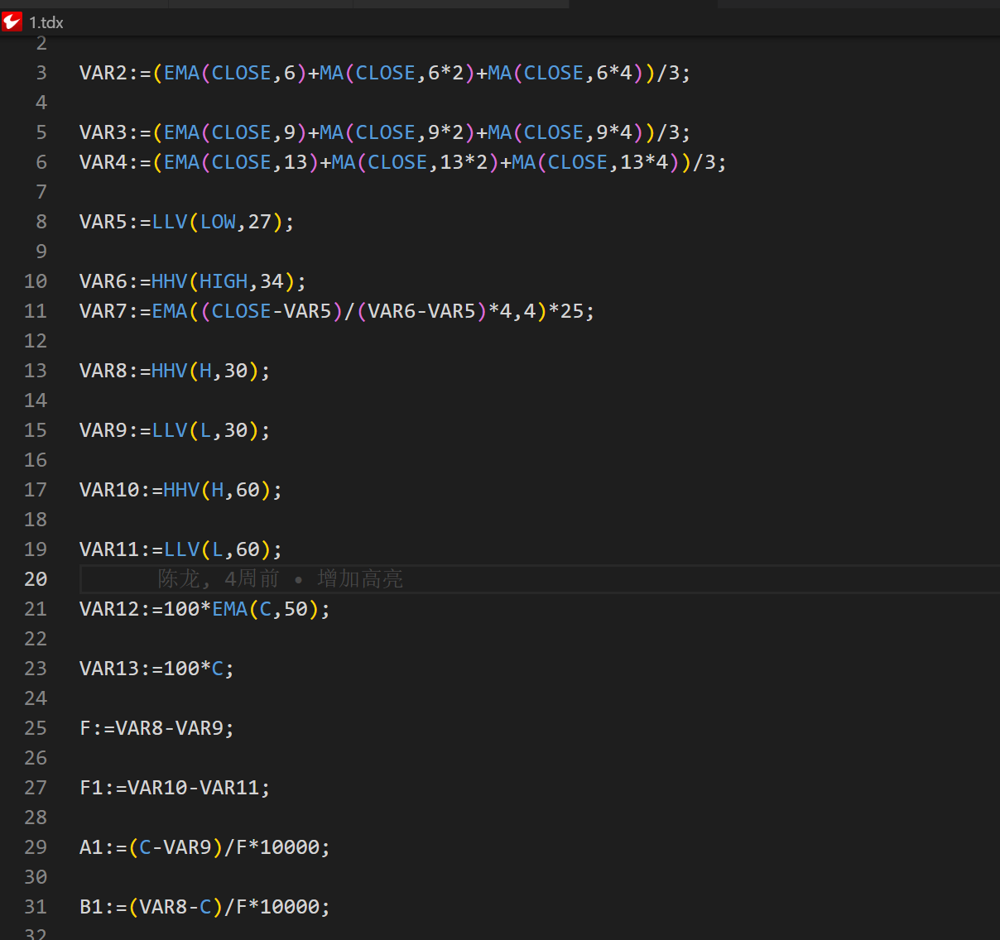

##  功能特性

本插件具有以下特点：

- 增加对tdx文件的支持
- 基于最新的通达信客户端开发，收录了所有通达信的指标
- 关键字高亮
- 详尽的函数说明文档
> 基于通达信金融终端V7.63，公式管理器V6.05开发

##  开始使用

安装插件：[VisualStudio - Marketplace](https://marketplace.visualstudio.com/items?itemName=giscafer.leek-fund)，VSCode 最低版本要求：`^1.76.0`

## 插件介绍
在本地新建后缀名为tdx的文件，即可使用插件的功能，如下图所示：

##  开发计划
- 增加侧边栏搜索页面，方便快捷查找指标和学习

## Changelog

[CHANGELOG](./CHANGELOG.md)

## License

[LICENSE](./LICENSE)